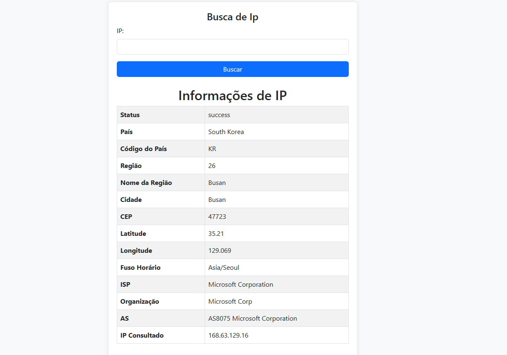

# Geolocalização por IP - Aplicação Spring Boot

## 📋 Descrição
Aplicação Web que consulta informações de geolocalização utilizando a API [ip-api.com](http://ip-api.com).

### Documentação da Api: https://ip-api.com/docs

### Imagem da tela de busca:

## 🛠️ Tecnologias
- Java 
- Spring Boot 
- Thymeleaf
- Bootstrap 5
- API ip-api.com

## desenvolvido por: 
- Samuel Monteiro Ferreira